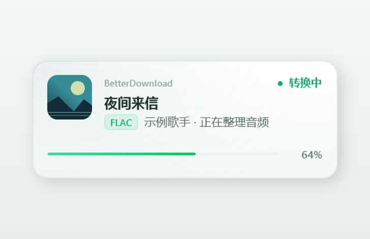
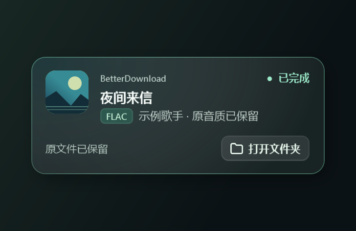
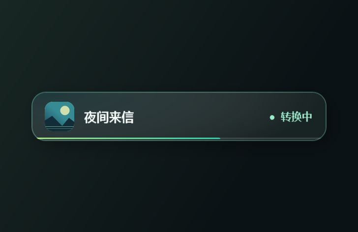
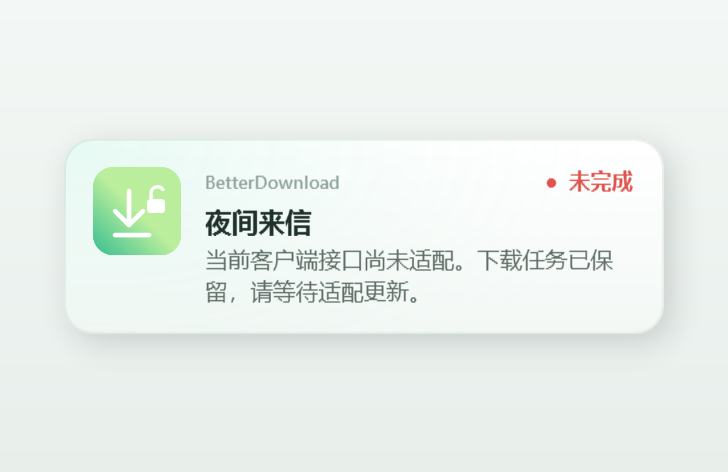
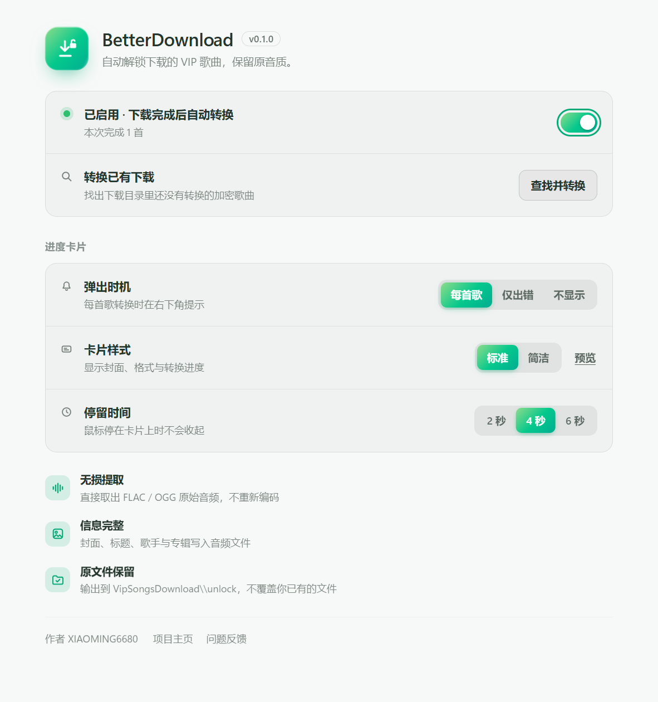

<div align="center">

[网易云音乐版](https://github.com/xiaoming6680/NCM-BetterDownload) | **QQ 音乐版**


# BetterDownload

**下载的 VIP 歌曲，自动变成在哪都能播放的音乐文件。**

QQ 音乐下载完成后，BetterDownload 在本地还原原始 FLAC / OGG，<br>
保留歌曲信息，补入可用的本地封面。原音质和原文件都保留。

[安装与使用](#安装与使用) · [更新记录](CHANGELOG.md) · [问题反馈](https://github.com/xiaoming6680/QQM-BetterDownload/issues)

</div>

> 开发预览版。已验证 QQ 音乐 22.71 x86 的整曲 FLAC 转换；透明入口、内嵌 HTML 设置和卡片已进行实机检查。新下载到自动转换的完整流程仍待验收，暂未发布正式安装包。

## 为什么需要它

QQ 音乐的部分 VIP 下载保存为加密的 `.mflac`、`.mgg` 文件。想放到车机、手机或其他播放器里，或者整理自己的音乐库，还需要转换一步。

BetterDownload 将这一步接到下载完成事件上：收到最终文件路径后自动排队，转换结果保存到 `unlock`。

## 它是怎么工作的


```text
D:/Music/VipSongsDownload/歌手/歌曲.mflac
→ D:/Music/VipSongsDownload/unlock/歌手/歌曲.flac
```

- **原音质**：直接还原原始音频，不重新编码；完成后校验音频完整性。
- **歌曲信息**：沿用标题、歌手、专辑等标签，保留内嵌封面，也可从本地缓存精确匹配补入。
- **原文件保留**：输出保留子文件夹，遇到同名文件编号另存，已完成且未改变的文件自动跳过。
- **完全本地**：不上传歌曲，不读取登录令牌，不联网获取歌曲密钥或补图。
- **自动识别路径**：从 QQ 音乐成功的文件操作获取新下载的最终位置，记住对应下载目录。启动时补处理已知目录中的已有下载。

## 进度卡片

转换时在 **QQ 音乐内部右下角** 弹出卡片，显示封面、格式与进度。卡片随应用隐藏，并在停留结束后收起。

<table>
<tr>
<td></td>
<td></td>
</tr>
<tr><td align="center">转换中</td><td align="center">转换完成</td></tr>
<tr>
<td></td>
<td></td>
</tr>
<tr><td align="center">简洁样式</td><td align="center">出错提示</td></tr>
</table>

鼠标悬停时保持显示，移开后重新计时；右键可提前收起。可选择“每首歌 / 仅出错 / 不显示”，以及 2 / 4 / 6 秒停留时间。

> 卡片图由程序真实控件渲染，使用虚构歌曲和示意封面。

## 设置页

沿用网易云版的 HTML 设计与文案，使用 QQ 音乐绿配色。页面由 QQ 音乐进程内的原生 HTML 控件承载，入口与卡片也交给客户端自己的 GF 界面框架绘制。

右上角使用透明细线入口图标。收放侧栏时，设置页随内容区域调整；点击侧栏导航切换页面时自动退出设置。

<p align="center"></p>

- **自动转换**：安装后默认开启，无需填写安装、下载或缓存路径。
- **转换已有下载**：点击“查找并转换”，结果直接显示在按钮旁；无目录、无文件或查找失败都有提示。
- **进度卡片**：调整弹出时机、样式和停留时间，点击“预览”查看示例。

## 安装与使用

需要 Windows 10 / 11、.NET Framework 4.6.2 或更高版本。当前原生界面适配 QQ 音乐 22.71 x86；独立开发预览另需 Microsoft Edge WebView2 Runtime。

1. 运行 `BetterDownload-Setup.exe`，点击“安装 / 修复”。程序安装到当前用户目录。
2. 正常打开 QQ 音乐并下载你有下载权限的歌曲。新下载自动处理，不需要逐首点击转换。
3. 结果在原下载目录下的 `VipSongsDownload/unlock`；完成卡片可打开输出文件夹。
4. 要调整设置，点击 QQ 音乐右上角的 BetterDownload 图标。再次点击图标或按 Esc 返回 QQ 音乐。

**现阶段安装器需从源码构建**，见 [开发说明](docs/BUILD.md)。桌面入口用于打开应用内设置；托盘菜单可作为备用入口。

如果之前把歌曲下载到一个尚未记录的自定义目录，先在该目录正常下载一首歌曲，程序会记住位置并补处理已有文件。默认 Windows 下载目录中的 `VipSongsDownload` 会自动识别。程序不遍历整个磁盘，也不处理播放缓存。

安装器会注册当前用户的 Windows 登录自动启动。后台等待 QQ 音乐打开后接入，客户端退出后继续等待下次启动。更新 BetterDownload 时，如果 QQ 音乐仍占用旧接入组件，新版本会暂存，待 QQ 音乐正常退出后生效。

## 兼容性与客户端更新

| 部分 | 当前范围 |
| --- | --- |
| QQ 音乐 22.71 x86 · musicex V1 FLAC | 已用真实歌曲整曲验证，PCM 校验通过 |
| 标签和本地封面 | 已验证标签读取与封面写入 |
| QTag / QMC2 V1 文件内密钥 | 原创夹具验证；尚无旧客户端实测 |
| OGG | 已实现校验，真实下载样本待验收 |
| M4A / MP3 / QMC1 | 暂未支持 |
| 进程内设置与卡片 | 22.71 x86 已显示原生入口、HTML 设置和右下角卡片；最新交互修正待实机复测 |
| 下载事件与路径记忆 | 独立宿主与合成下载测试通过；真实新下载全流程待验收 |

接入组件位于用户目录，QQ 音乐重启后会自动重新连接，不需要向客户端目录重复复制 DLL。客户端更新改变内部密钥接口时仍需适配；未知接口会保留下载任务，支持的旧格式可继续处理。

**在线适配清单与自动更新服务尚未实现**，因此当前不能承诺未来每个 QQ 音乐版本都无需维护。版本处理参考 BetterNCM-Installer，详见 [兼容性说明](docs/COMPATIBILITY.md)。

## 常见问题

<details>
<summary>“查找并转换”没有找到歌曲怎么办？</summary>

先看按钮旁的结果。尚未识别下载目录时，在 QQ 音乐里正常下载一首即可记录位置；没有需要转换的文件时不产生输出。新格式需要本机保存对应密钥，缺失时会保留原文件和待处理任务。

</details>

<details>
<summary>下载路径、分类或命名方式变了怎么办？</summary>

新下载事件直接提供最终路径，无需从文件名反推歌曲。歌手或专辑子目录保留到输出中。当前仅处理本地 `VipSongsDownload` 中的受支持加密文件，目录链接和网络路径不在处理范围内。

</details>

<details>
<summary>为什么没有卡片或封面？</summary>

普通音频不需要转换；检查卡片是否设为“仅出错”或“不显示”。封面使用音频内嵌图片或精确匹配的本地缓存，找不到时照常输出完整音频。

</details>

## 开发者

```powershell
.\scripts\build.ps1
.\scripts\build-native.ps1 -Tests
.\scripts\build.ps1 -Tests
.\build\tests.exe
.\scripts\build-setup.ps1 -SkipBuild
.\scripts\check-repo.ps1
```

目前通过 **130 项程序检查** 和 **18 项安装器检查**，覆盖转换、自动路径、主窗口识别与最小化、安装路径可见性、本地页面通信、独立 HTML 预览及关闭回归。正式安装版已验证 QQ 音乐退出重开后恢复入口；其余私有 GF 界面的实际绘制效果另行实机验收，不能由这些检查代替。工具链与依赖下载到忽略目录并校验固定哈希；真实歌曲、配置、密钥和研究资料不进入仓库。

封面由 [HTML / SVG 源码](promo/cover.html) 程序化渲染，生成方法见 [开发说明](docs/BUILD.md)。更多结果见 [验证记录](docs/VALIDATION.md) 和 [验收清单](docs/ACCEPTANCE.md)。

## 开源协议

GPL-3.0。第三方许可及参考项目见 [THIRD-PARTY-NOTICES.md](THIRD-PARTY-NOTICES.md)。

作者 [XIAOMING6680](https://github.com/xiaoming6680)。仓库名为 `QQM-BetterDownload`，软件名称为 **BetterDownload**。
