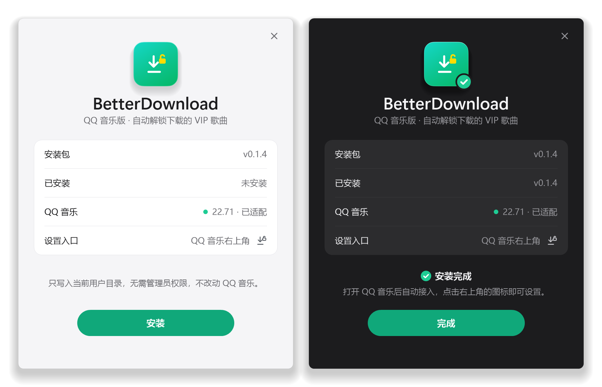

[网易云音乐版](https://github.com/xiaoming6680/NCM-BetterDownload) | **QQ 音乐版**

# BetterDownload

**下载的 VIP 歌曲，自动变成在哪都能播放的音乐文件。**

[下载](https://github.com/xiaoming6680/QQM-BetterDownload/releases) · [更新记录](CHANGELOG.md) · [问题反馈](https://github.com/xiaoming6680/QQM-BetterDownload/issues)

> 测试版，已在 QQ 音乐 22.71（Windows）上验证。非官方工具，仅供个人使用。

## 它能做什么

QQ 音乐的 VIP 歌曲和高音质下载是加密文件，只能在 QQ 音乐里播放。装上 BetterDownload 后，每首歌下载完成都会自动转换成普通音乐文件，放在下载目录的 `VipSongsDownload\unlock` 里，车机、手机和其他播放器都能直接用。

- **原音质**：直接还原，不重新编码
- **信息完整**：保留标题、歌手、专辑，补上封面和歌词
- **原文件保留**：加密的原文件不动
- **完全本地**：不上传歌曲，不读取账号信息；只有点“检查更新”时才联网

| 下载音质 | 加密文件 | 转换后 |
| --- | --- | --- |
| 标准、HQ | `.mgg` | OGG |
| SQ 无损、臻品全景声、臻品母带 | `.mflac` | FLAC |
| 杜比全景声 | `.mmp4` | MP4（尚未用真实下载验证） |

普通歌曲的标准、HQ、SQ 下载本来就不加密，不需要转换。

## 安装

1. 从 [Releases](https://github.com/xiaoming6680/QQM-BetterDownload/releases) 下载 `BetterDownload-Setup.exe`，运行后点击“安装”。
2. 像平常一样在 QQ 音乐里下载歌曲，下载完成后会自动转换。

需要 Windows 10 / 11 和 QQ 音乐 PC 版。不需要管理员权限，也不改动 QQ 音乐的文件。安装包暂未签名，Windows 提示“未知发布者”时选择“仍要运行”。

- **更新**：下载新版安装器运行即可。建议先退出 QQ 音乐，否则新版本会在 QQ 退出后生效。
- **卸载**：在 Windows“已安装的应用”里，或设置页底部点“卸载”。默认保留歌曲和设置。

## 使用

转换时，QQ 音乐右下角会弹出卡片显示进度；连续转换多首时合并在同一张卡片里。

<table>
<tr>
<td></td>
<td></td>
</tr>
</table>

点击 QQ 音乐右上角的 BetterDownload 图标（带小锁的下载箭头）打开设置：

- **自动转换**：默认开启，不用设置任何路径。
- **查找并转换**：补上以前下载、还没转换的歌，按钮旁会说明找到了什么、处理结果如何。
- **写入歌词**：把 QQ 音乐下载的歌词写进文件，需要在 QQ 设置里勾选“同时下载歌词”；也可以另存 `.lrc` 文件。
- **进度卡片**：选择弹出时机、样式和停留时间。
- **检查更新**：点击时查询是否有新版本。

## 常见问题

转换好的歌在哪里？

在 QQ 音乐下载目录的 `VipSongsDownload\unlock` 里，原来的子文件夹结构不变，例如 `VipSongsDownload\歌手\歌曲.mflac` 会转换为 `VipSongsDownload\unlock\歌手\歌曲.flac`。完成卡片上的“打开文件夹”可以直接打开。

“查找并转换”没有找到歌曲？

先看按钮旁的说明。如果还没识别到下载目录，在 QQ 音乐里正常下载一首歌，BetterDownload 就会记住这个目录。已经转换过的歌不会重复转换；想重新转换，删掉 `unlock` 里对应的文件再查找。

为什么没有封面或歌词？

封面来自 QQ 音乐的本地图片缓存，歌词来自 QQ 随歌曲下载的 `.lrc`（需要勾选“同时下载歌词”）。找不到时，照常输出完整的音频。

看不到右上角的图标？

QQ 音乐版本较新、界面还没适配时，按 Alt+空格 打开窗口菜单，选择“BetterDownload 设置”。自动转换不受影响。

QQ 音乐更新后还能用吗？

大多数更新不受影响。如果新版改动了相关组件，需要等 BetterDownload 发布适配更新；在此之前下载的原文件都会保留，适配后用“查找并转换”补上即可。

## 开发

从源码构建、兼容性细节和验证记录见 [开发说明](docs/BUILD.md)、[兼容性说明](docs/COMPATIBILITY.md) 和 [验证记录](docs/VALIDATION.md)。

## 开源协议

GPL-3.0，第三方许可见 [THIRD-PARTY-NOTICES.md](THIRD-PARTY-NOTICES.md)。作者 [XIAOMING6680](https://github.com/xiaoming6680)。
